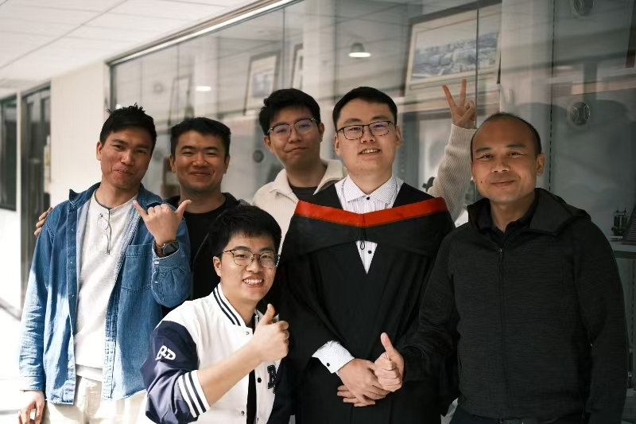

  
  

    <h1 style="
      font-family: 'Times New Roman', Times, serif;
      font-size: 28px;
      font-weight: 700;
      margin: 0 0 8px 0;
      letter-spacing: 0.5px;
      color: #000000;
    ">
      Dr. LIU Junwei
    </h1>
  

  
  

    

      Research Assistant Professor
    

    

      Department of Electrical and Electronic Engineering
    

    

      The Hong Kong Polytechnic University
    

  

  
  

    

      
        Office:
      
      DE633
    

    

      
        Tel:
      
      +852 2766 6129
    

    

      
        Email:
      
      <a href="mailto:junwei.jw.liu@polyu.edu.hk" 
         style="
           font-family: 'Times New Roman', Times, serif;
           color: #000000;
           text-decoration: underline;
           font-weight: 500;
         ">
        junwei.jw.liu@polyu.edu.hk
      </a>
    

  

### Biography

**Dr. Junwei LIU** is currently a **Research Assistant Professor** in the [Department of Electrical Engineering at The Hong Kong Polytechnic University (PolyU)](https://www.polyu.edu.hk/eee/people/academic-staff-and-teaching-staff/dr-liu-junwei/). He earned his Ph.D. in Power Electronics from PolyU in 2018 under the prestigious **Hong Kong PhD Fellowship Scheme (HKPFS)**. And he received the Bachelor of Engineering in Water Conservancy and Hydropower Engineering with undergraduate excellence (Top 3% Ranking) at Huazhong University of Science and Technology in 2012. He leads group to focus the advancement of 3-rd generation WBG device, isolated gate driver technology, power converter, solid-state transformer (SST), modular multilevel converter (MMC) in medium voltage application. His innovative contributions to the field have earned him high-profile accolades, most notably a **Gold Medal at the 49th International Exhibition of Inventions Geneva (2024)**, reflecting his ability to bridge the gap between fundamental research and high-impact industrial applications.  Dr. Liu’s research caliber is globally recognized, evidenced by his inclusion in the **World’s Top 2% Scientists** list by Stanford University (2025). His academic rigor has also gained international recognition, earning him the "Outstanding Reviewer" title for two consecutive years from top IEEE journals (2021–2022).

As a **Principal Investigator (PI)**, Dr. Liu has successfully secured and led multiple competitive research grants totaling over **HK$ 6.8 million**, including major projects funded by the **Innovation and Technology Fund (ITF)**. His prolific scholarly output includes **30+ high-impact journal papers** (predominantly IEEE TPEL Q1) focusing state-of-the-art technology in EEE research.

### Working Experience

  <strong style="color: #3498db;">2023.02 – Present</strong>  
  <strong>Research Assistant Professor</strong> | The Hong Kong Polytechnic University
  <ul style="margin-top: 5px; font-size: 0.95em;">
    <li>Leading an elite research unit of <b>5 Postdoctoral Fellows</b> and <b>5 Ph.D./Research Students</b>.</li>
    <li>Directing high-stakes R&D projects funded by competitive grants ($6.8M+).</li>
  </ul>

  <strong style="color: #3498db;">2021.03 – 2023.02</strong>  
  <strong>Research Fellow</strong> | The Hong Kong Polytechnic University
  <ul style="margin-top: 5px; font-size: 0.95em;">
    <li>Engineered a flagship 11-kW on-board EV charger with a peak efficiency of <b>96.6%</b>.</li>
    <li>Breakthrough in power density (<b>3.5-kW/L</b>) using novel single-stage AC/DC topologies.</li>
  </ul>

  <strong style="color: #3498db;">2021.01 – 2022.02</strong>  
  <strong>Research Scientist</strong> | Centre for Advances in Reliability and Safety (CAiRS)

  <strong style="color: #3498db;">2018.11 – 2019.12</strong>  
  <strong>Postdoctoral Research Fellow</strong> | The Hong Kong Polytechnic University

  <strong style="color: #3498db;">2018.03 – 2018.11</strong>  
  <strong>Assistant Engineering Officer</strong> | APAS, Hong Kong Productivity Council (HKPC)

<h3 style="border-bottom: 1px solid #eee; padding-bottom: 10px; margin-top: 40px;">Academic Activities</h3>

  

    
<strong><i class="fas fa-edit" style="color: #3498db; margin-right: 5px; font-size: 0.9em;"></i> Editorial & Committee Appointments</strong>

    <ul style="list-style: disc; padding-left: 20px; font-size: 0.95em; margin-top: 5px;">
      <li style="margin-bottom: 5px;">Technical Committee Member, Railway Electrification of IEEE Transportation Electrification Council.</li>
      <li style="margin-bottom: 5px;">Guest Associate Editor, Special Issue on <em>Safe and Advanced Low-Carbon Rail Transportation Electrification Technologies</em>, High-speed Railway.</li>
      <li style="margin-bottom: 5px;">Competition Chair & Session Chair, 10th International Conference on Power Electronics Systems and Applications (PESA 2024).</li>
    </ul>
  

  

    
<strong><i class="fas fa-university" style="color: #3498db; margin-right: 5px; font-size: 0.9em;"></i> Institutional Affiliations (PolyU)</strong>

    

      Research Centre for Grid Modernisation
      Research Centre for Electric Vehicles
      Research Institute for Smart Energy
    

  

  

    
<strong><i class="fas fa-users" style="color: #3498db; margin-right: 5px; font-size: 0.9em;"></i> Professional Memberships</strong>

    

      IEEE Member: PES, IES, and PELS.
    

  

  

    
<strong><i class="fas fa-microphone-alt" style="color: #3498db; margin-right: 5px; font-size: 0.9em;"></i> Invited Presentations</strong>

    <ul style="list-style: disc; padding-left: 20px; font-size: 0.95em; margin-top: 5px;">
      <li style="margin-bottom: 5px;">Invited Speaker & Tutorial Speaker, PESA, Hong Kong, 2024.</li>
      <li style="margin-bottom: 5px;">Invited Speaker, 11th Int. Conf. of Precision Agricultural Aviation, Guangzhou, 2024.</li>
    </ul>
  

  

    
<strong><i class="fas fa-check-circle" style="color: #3498db; margin-right: 5px; font-size: 0.9em;"></i> Professional Review Service</strong>

    
Active reviewer for top-tier journals (120+ reviews for IEEE TIE):

    

      IEEE TIE
      IEEE TPEL
      IEEE TTE
      IEEE JESTPE
      IEEE TEC
    

  

---

### The Research Group

Dr. Liu currently leads the PolyU Advanced Power Electronics Research (PAPER) group, a distinctive team comprising five senior postdoctoral fellows and two highly self-motivated, creative PhD students. The team has already gained international recognition for its research outcomes, demonstrating notable impact. The group is dedicated to push the boundary of the application for next-generation medium-voltage power electronic converter applications.

<b>PAPER Group Portrait 202511<b>.

<b>PAPER Group Portrait 202601<b>.
