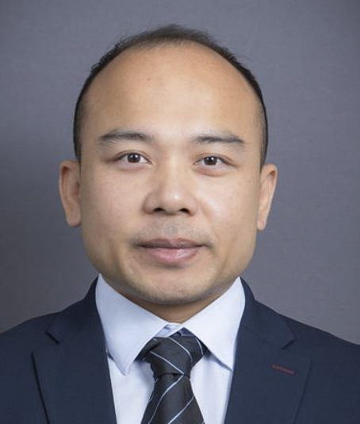

### Biography

**Dr. Junwei LIU** is currently a **Research Assistant Professor** in the [Department of Electrical Engineering at The Hong Kong Polytechnic University (PolyU)](https://www.polyu.edu.hk/eee/people/academic-staff-and-teaching-staff/dr-liu-junwei/). He earned his Ph.D. in Power Electronics from PolyU in 2018 under the prestigious **Hong Kong PhD Fellowship Scheme (HKPFS)**, following his undergraduate excellence (Top 3% Ranking) at Huazhong University of Science and Technology.Dr. Liu’s research caliber is globally recognized, evidenced by his inclusion in the **World’s Top 2% Scientists** list by Stanford University (2025). His innovative contributions to the field have earned him high-profile accolades, most notably a **Gold Medal at the 49th International Exhibition of Inventions Geneva (2024)**, reflecting his ability to bridge the gap between fundamental research and high-impact industrial applications.

###  Technical Expertise & Research Leadership

With dedication to advanced power electronic technologies, Dr. Liu has established a formidable track record in:

* **Integrated Wireless Power Transfer (WPT):** High-power, high-efficiency topologies for electric vehicles (EV) and industrial automation.

* **Next-Generation Power Converters:** Expertise in **Medium-Voltage (MV) Silicon Carbide (SiC)** applications and **Solid-State Transformers (SST)**.

* **Smart Grid & Transportation:** Developing resilient grid interfaces and sustainable energy solutions for electrified transportation.

###  Grant & Research Impact
As a **Principal Investigator (PI)**, Dr. Liu has successfully secured and led multiple competitive research grants totaling over **HK$ 6.8 million**, including major projects funded by the **Innovation and Technology Fund (ITF)**. His prolific scholarly output includes **30+ high-impact journal papers** (predominantly IEEE TPEL Q1) focusing state-of-the-art technology in EEE research.

### Working Experience

  <strong style="color: #3498db;">2023.02 – Present</strong>  
  <strong>Research Assistant Professor</strong> | The Hong Kong Polytechnic University
  <ul style="margin-top: 5px; font-size: 0.95em; color: #444;">
    <li>Leading an elite research unit of <b>5 Postdoctoral Fellows</b> and <b>5 Ph.D./Research Students</b>.</li>
    <li>Directing high-stakes R&D projects funded by competitive grants ($6.8M+).</li>
  </ul>

  <strong style="color: #3498db;">2021.03 – 2023.02</strong>  
  <strong>Research Fellow</strong> | The Hong Kong Polytechnic University
  <ul style="margin-top: 5px; font-size: 0.95em; color: #444;">
    <li>Engineered a flagship 11-kW on-board EV charger with a peak efficiency of <b>96.6%</b>.</li>
    <li>Breakthrough in power density (<b>3.5-kW/L</b>) using novel single-stage AC/DC topologies.</li>
  </ul>

  <strong style="color: #3498db;">2021.01 – 2022.02</strong>  
  <strong>Research Scientist</strong> | Centre for Advances in Reliability and Safety (CAiRS)

  <strong style="color: #3498db;">2018.11 – 2019.12</strong>  
  <strong>Postdoctoral Research Fellow</strong> | The Hong Kong Polytechnic University

  <strong style="color: #3498db;">2018.03 – 2018.11</strong>  
  <strong>Assistant Engineering Officer</strong> | APAS, Hong Kong Productivity Council (HKPC)

---

### The Research Group

Dr. Liu currently leads a dedicated research group at PolyU, distinguished by integrating the 5 expertise of senior Postdoctoral Fellows with the 2 creative energy of Doctoral Scholars.The team has already demonstrated its high-impact potential through international recognition. The group is uniquely positioned as an innovation powerhouse, dedicated to reimagining power architectures for the next generation SiC devices.

PolyU Advanced Power Electronic Research Group (PAPER).

